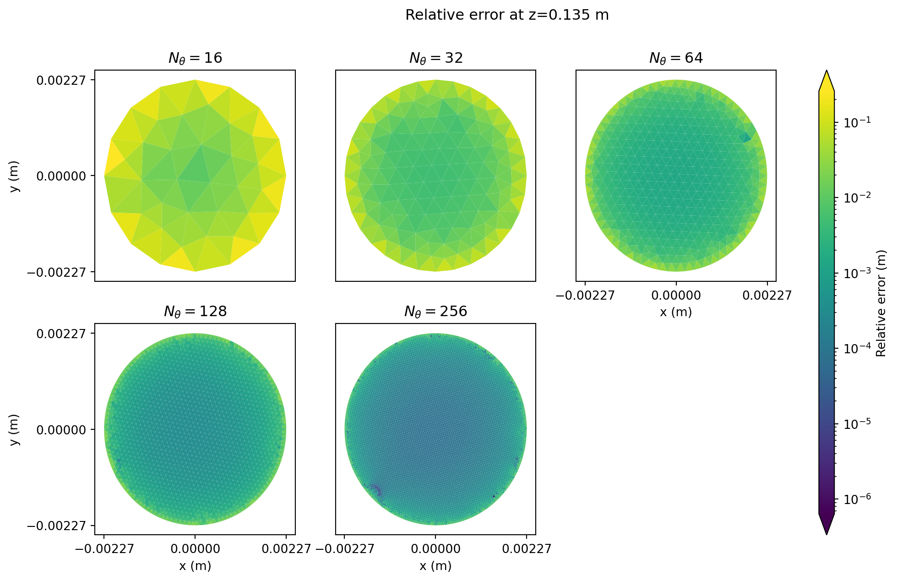

A reproducibility package for simulation verification of pipe flow with OpenFOAM.

## Usage
--------

### Creating a Singularity/Apptainer image
-------------------------------------------

We use a Singularity (or what is now named Apptainer) image to provide all required tools (e.g.,
OpenFOAM, Gmsh, Python, etc.). Using a Singularity image guarantees that we don't need to install
anything else on working machines or HPC clusters.

If the current user has root privilege, then simply do (assuming currently under the repo folder):

```shell
# singularity build openfoam9.sif ./Singularity
```

If the current user does not have root privilege, try

```shell
$ singularity build --fakeroot openfoam9.sif ./Singularity
```
The above command requires the system admins to correctly configure the user namespace. To see if
the user namespace is configured correctly, check the files `/etc/subuid` and `/etc/subgid` and find
the line with your username and your group:

```shell
$ cat /etc/subuid
-------------------
...
<your username>:<a number much greater than 65535>:<a number greater than 98765>
...
```

```shell
$ cat /etc/subgid
-------------------
...
<the group you belong to>:<a number much greater than 65535>:<a number greater than 98765>
...
```

If these two options do not work for you, try the cloud builders: https://cloud.sylabs.io/builder

Finally, if using Apptainer (the newer community version of Singularity), just substitute
`singularity` with `apptainer`.


### Creating case folders
-------------------------

To create case folders:

```shell
$ singularity exec openfoam9.sif python ./main.py
```

As this is a reproducibility package, what cases to create are hard coded.

To create a custom case, use the following command to see how to use `main.py` to do so:

```shell
$ singularity exec openfoam9.sif python ./main.py --help
```

***Note***!! The script `main.py` will create mesh files on the fly. Generating meshes requires a
non-trivial amount of memory, especially for the case `airflow-pipe-256` (and `airflow-pip-512`, if
it exists). It may crash on small personal desktops and laptops.


### Running cases
-----------------

Each case has a file `job.sh` that can be used as either a Slurm job script or a regular shell
script.

If using it as a Slurm script, note that the resource configuration in `job.sh` is based on the
Pegasus cluster at the George Washington University. You may need to manually change the
configuration based on your cluster.

To submit a case using Slurm:

```shell
$ cd <a case folder>
$ sbatch job.sh
```

`job.sh` uses the OpenFOAM installation in the Singularity/Apptainer image. So the cluster must
have Singularity/Apptainer. The script assumes the cluster uses Lmod and loads
Singularity through `module load singularity`. The cluster also needs OpenMPI 4.0+ and loads
OpenMPI through `module load openmpi/gcc/64/4.1.0`. Modify them based on the actual clusters being
used.

To run a case using a regular Linux machine:

```shell
$ sh ./job.sh <number of MPI processes to use>
```

## Results
----------

* Absolute error (against analytical soln.) at cross section z=0.135m
  
* Relative error (against analytical soln.) at cross section z=0.135m
  
* Error convergence of the maximum velocity in the entire domain
  
* Error convergence of the maximum velocity at cross section z=0.135m
  
* Error convergence of the $L_\infty$ at cross section z=0.135m
  
* Error convergence of the $L_2$ at cross section z=0.135m
  
